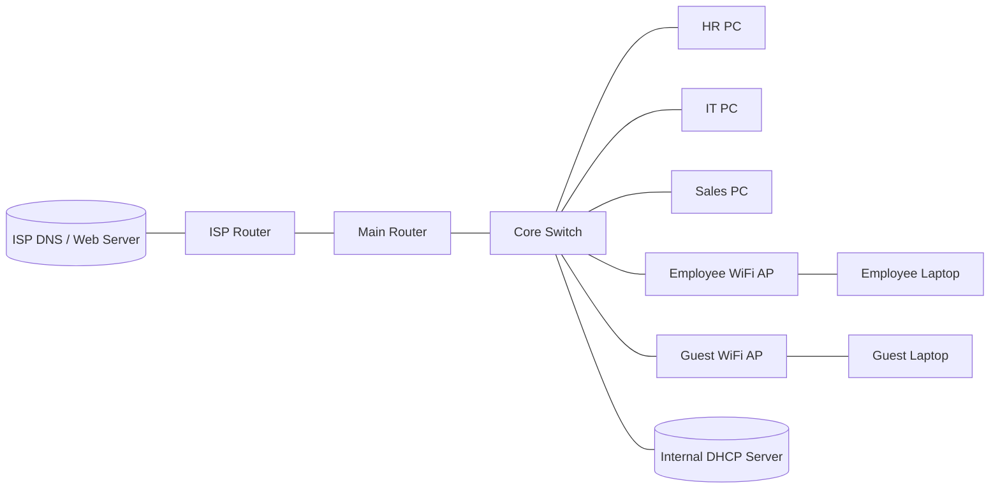

# Packet Tracer Small Business Network

This Packet Tracer project models a small business network with department VLANs, wireless access, DHCP, NAT, DNS, and a public web server.

## Topology

## What this network does

- Segments departments with VLANs
- Routes between VLANs with router-on-a-stick
- Uses DHCP for client addressing
- Uses ACLs to control access between departments
- Adds employee WiFi and guest WiFi on separate VLANs
- Uses NAT to reach a simulated ISP network
- Uses DNS to browse the public web server by name

## Build Steps

### 1. Build the physical layout

Place the router, switch, internal server, ISP router, ISP server, PCs, APs, and laptops. Keep the internal devices on the switch and use the router for VLAN routing and internet access.

### 2. Create VLANs and trunking

Create VLAN 10 for HR, VLAN 20 for IT, VLAN 30 for Sales, VLAN 40 for employee WiFi, and VLAN 50 for guest WiFi. Put the router link on a trunk and assign each access port to the correct VLAN.

### 3. Configure the router

Create subinterfaces for each VLAN and assign the gateway IPs:

- VLAN 10: 192.168.10.1
- VLAN 20: 192.168.20.1
- VLAN 30: 192.168.30.1
- VLAN 40: 192.168.40.1
- VLAN 50: 192.168.50.1

Also configure the NAT outside interface toward the ISP router.

### 4. Configure DHCP on the server

Use the internal server for DHCP pools. A good example is shown in [this screenshot](screenshots/Screenshot%202026-04-18%20165718.png).

Pools used in the project:

- HR Pool: 192.168.10.0/24
- IT Pool: 192.168.20.0/24
- Sales Pool: 192.168.30.0/24
- WIFI Pool: 192.168.40.0/24
- GUEST Pool: 192.168.50.0/24

### 5. Add wireless access

Use one access point for employee WiFi and one for guest WiFi. Put each AP on its own VLAN and connect laptops to the correct SSID.

### 6. Add internet simulation

Connect the main router to the ISP router, then connect the ISP router to the ISP server subnet. Configure NAT on the main router so internal devices can reach the public side.

### 7. Add DNS and web hosting

Turn on HTTP and DNS on the ISP-side server, then add a DNS record like `jorgetestsite.com` pointing to the web server IP. The final browser test is shown in [this screenshot](screenshots/Screenshot%202026-04-18%20170947.png).

### 8. Verify the lab

Use ping and the browser to verify the full path:

- Client gets a DHCP address
- VLAN gateway responds
- DNS name resolves
- Web page loads successfully

Troubleshooting was part of the lab too. The DHCP failure state is captured in [this screenshot](screenshots/Screenshot%202026-04-18%20162048.png), and a DNS lookup failure is shown in [this screenshot](screenshots/Screenshot%202026-04-18%20171312.png).

## Screenshot guide

Use these images in order if you want to present the project clearly:

1. [DHCP pools on the server](screenshots/Screenshot%202026-04-18%20165718.png)
2. [Client IP / DHCP troubleshooting](screenshots/Screenshot%202026-04-18%20162048.png)
3. [Ping tests from the guest VLAN](screenshots/Screenshot%202026-04-18%20152553.png)
4. [DNS lookup failure during troubleshooting](screenshots/Screenshot%202026-04-18%20171312.png)
5. [Web page working through DNS](screenshots/Screenshot%202026-04-18%20170947.png)

## Summary

This project is a realistic small business Packet Tracer lab that demonstrates segmentation, wireless networking, DHCP, NAT, DNS, and basic access control.
